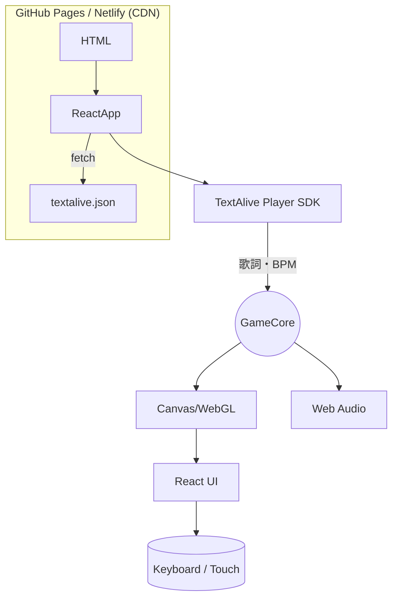

## LyricRails! ― 完全要件定義書（Ver 1.0・2025-06-04）

---

### 1. 背景・目的

- **マジカル未来プログラミングコンテスト2025**（締切 2025-07-08 12:00 JST）に応募し、最優秀賞を目指す。([crypton.co.jp](https://www.crypton.co.jp/cfm/news/2025/04/10mm25procon?utm_source=chatgpt.com))
- **TextAlive App API** で取得した歌詞タイムタグから譜面を自動生成し、歌詞とシンクロして叩ける “リリック×リズムゲーム” をブラウザで提供する。([blog.crypton.co.jp](https://blog.crypton.co.jp/l/2025/04/11mm25procon/?utm_source=chatgpt.com))
- **完全静的 Web アプリ** として公開し、来場者の PC／スマホで即プレイ可能にする。

---

### 2. ステークホルダー

| 役割 | 関与内容 |
| --- | --- |
| プロダクトオーナー | 企画決定・UI 品質チェック |
| 開発チーム（2 名） | 実装／テスト／ビルド |
| 外部テスター（3 名） | 6/28 以降の QA |
| コンテスト主催 | 技術審査・著作権審査 |

---

### 3. スコープ

| 区分 | 内容 |
| --- | --- |
| **対象プラットフォーム** | Chrome 122+, Safari 17+, Edge 123+（PC／iOS／Android） |
| **使用技術** | React 18 + Next.js 14（`output:"export"`）、TypeScript、TailwindCSS、Canvas/WebGL、TextAlive App API |
| **配信方法** | GitHub Pages & Netlify (静的) |
| **除外事項** | サーバー側スコア保存、マルチプレイ、ネイティブアプリ、オフライン動作 |

---

### 4. 技術制約（コンテスト規約準拠）

| ID | 制約 | 対応方針 |
| --- | --- | --- |
| C-01 | ソースは **HTML/CSS/JS の静的ファイルのみ** | `next export` 生成物 `/out` を提出 |
| C-02 | **TextAlive App API 利用必須** | Player 初期化／lyrics イベント使用 |
| C-03 | **AI 生成素材禁止**（画像・音声・テキスト） | 背景は CSS グラデ or 手描き SVG |
| C-04 | **難読化・最小化禁止** | production ビルドでもソースマップ付与 |
| C-05 | **ライセンス明示** | README に第三者素材一覧を記載 |

---

### 5. 機能要件

| ID | 機能 | 詳細 |
| --- | --- | --- |
| **F-01** | 曲選択 | 課題曲 6 曲をカード表示（BPM・長さ・難易度） |
| **F-02** | 歌詞→譜面自動生成 | `unit.startTime` からレーン位置・判定窓を算出 |
| **F-03** | ゲームプレイ | 60 fps 以上でノーツ描画、キーボード／タッチ入力 |
| **F-04** | 判定・スコア | Perfect/Great/Good/Miss、コンボ、スコア倍率 |
| **F-05** | リザルト画面 | スコア・精度・最大コンボ・歌詞シンク率 |
| **F-06** | モバイル UI | 縦 1 レーン＋大判ノーツ、タップ操作 |
| **F-07** | キー設定 | WASD／矢印等をユーザ変更、`localStorage` 保存 |
| **F-08** | SNS シェア | `intent/tweet` で結果画像＋ハッシュタグ投稿 |
| **F-09** | デバッグ HUD | FPS／unit.progress／シークバー（dev ビルドのみ） |

---

### 6. 非機能要件

| 分類 | 指標 |
| --- | --- |
| パフォーマンス | 初期ロード ≤ 5 s（4 G 回線）、描画 FPS ≧ 60 |
| アクセシビリティ | 色覚対応、コントラスト比 ≥ 4.5:1 |
| セキュリティ | CSP 設定、API Key を `.env` → ビルド時 embed |
| コード品質 | ESLint／Prettier／Vitest 100 % パス |
| 保守性 | component 単位 Storybook docs 付属 |

---

### 7. システム構成図



---

### 8. データフロー

1. 起動時 `meta.json` を取得→課題曲リスト描画
2. 曲選択→TextAlive Player の `requestMedia()` 実行
3. `lyrics` / `beat` イベントをキューに push
4. `requestAnimationFrame` でノーツ描画 & 判定
5. 結果オブジェクトを `localStorage` 保存→リザルト表示

---

### 9. 画面遷移

```
[タイトル] → [曲選択] → [プレイ] → [リザルト]
                        ↑              |
                        └──リトライ────┘

```

---

### 10. マイルストーン & スプリント計画

| Sprint | 期間 | 目標（完了条件） |
| --- | --- | --- |
| **S0** | 06-04 – 06-06 | Next.js 雛形 & 静的化成功、TextAlive サンプル再生 |
| **S1** | 06-07 – 06-11 | 歌詞→譜面エンジン＋判定ロジック完成 |
| **S2** | 06-12 – 06-18 | レイアウト & モバイル UI、60 fps 描画達成 |
| **S3** | 06-19 – 06-25 | 6 曲対応、リザルト画面実装 |
| **S4** | 06-26 – 07-02 | 性能最適化・アクセシビリティ適合・ライセンス整理 |
| **S5** | 07-04 – 07-06 | 最終ビルド、`v1.0.0` タグ＆提出物 `/out` 完成 |
| **提出** | 07-07 – 07-08 12:00 | GitHub 招待＋デモ動画＋応募フォーム送信 |

---

### 11. 受け入れ基準

| # | テスト項目 | 基準 |
| --- | --- | --- |
| AC-01 | 6 曲すべてが再生＆譜面生成される | 曲完走率 100 % |
| AC-02 | PC とスマホで FPS≥ 60 | Chrome DevTools 計測 |
| AC-03 | 譜面判定誤差 ≤ ±50 ms | 自動ユニットテスト |
| AC-04 | HTML/CSS/JS のみで動作 | Lighthouse > Network 静的ファイルのみ |
| AC-05 | 色覚テスト PASS | axe-core 重大 issue 0 |

---

### 12. リスク管理

| リスク | 影響 | 対策 |
| --- | --- | --- |
| TextAlive API 仕様変更 | 譜面生成不能 | lyrics cache & Discord チャンネル監視 |
| モバイル低性能端末 | FPS 低下 | Low-res Canvas fallback |
| コード難読化 NG 忘れ | 失格 | ビルド後スクリプトで map 存在チェック |

---

### 13. ディレクトリ構成（抜粋）

```yaml
LyricRails/
├─ app/                       # App Router エントリ
│  ├─ layout.tsx             # 共有レイアウト（<html>・<body>）
│  ├─ globals.css            # Tailwind @layer base/components/utilities
│  ├─ page.tsx               # ルート（タイトル or ランディング）
│  ├─ play/                  # プレイ画面ルートグループ
│  │   ├─ layout.tsx         # プレイ画面専用レイアウト（レーンCanvasなど）
│  │   ├─ [songId]/          # 動的ルート：曲IDごとの譜面
│  │   │   ├─ page.tsx       # <GameCore /> を呼び出す
│  │   │   └─ loading.tsx    # Skeleton／ローディングUI
│  │   └─ error.tsx          # 歌詞取得失敗などの例外ページ
│  ├─ result/                # リザルト画面
│  │   ├─ layout.tsx
│  │   └─ [songId]/page.tsx
│  └─ api/                   # **使用しない**（静的サイトのため）
│
├─ components/               # 再利用 UI（Button, Card, Gauge など）
├─ features/                 # ドメイン毎の機能単位
│  ├─ lyrics/                # 歌詞・譜面生成ロジック
│  ├─ gameplay/              # 判定・スコア計算
│  └─ settings/              # キー／UI 設定
├─ hooks/                    # useLyrics(), useAudioPosition() など
├─ lib/                      # TextAlive ラッパ・ユーティリティ
│  ├─ textalive.ts
│  └─ const.ts               # 難易度係数など
├─ public/                   # 手描き SVG・アイコン・Web フォント
├─ styles/                   # Tailwind のカスタム @apply 用 CSS
├─ textalive.json            # 課題曲メタデータ（BPM・YouTubeID 等）
├─ next.config.mjs           # `output: "export"` / basePath など
├─ tsconfig.json
└─ README.md
```

---

### 14. ビルド & 提出手順

```bash
# 1. 依存インストール
$ pnpm i

# 2. 静的ビルド
$ pnpm run build && pnpm run export   # => ./out

# 3. 動作確認
$ npx serve out

# 4. GitHub タグ
$ git tag v1.0.0 && git push --tags

```

提出物：

1. `/out` フォルダ（静的）
2. ソース（main ブランチ）＋ `README.md`
3. 3 分以内のデモ動画 URL

---